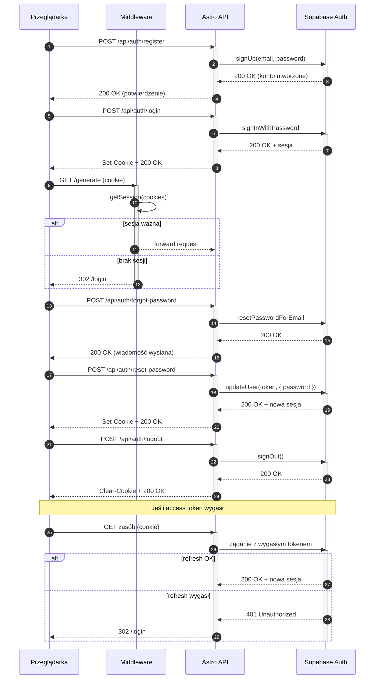

# Diagram przepływu autentykacji

```mermaid
sequenceDiagram
    autonumber
    participant Browser as Przeglądarka
    participant Middleware as Middleware
    participant API as Astro API
    participant Supabase as Supabase Auth

    %% Rejestracja
    Browser->>API: POST /api/auth/register
    activate API
    API->>Supabase: signUp(email, password)
    activate Supabase
    Supabase-->>API: 200 OK (konto utworzone)
    deactivate Supabase
    API-->>Browser: 200 OK (potwierdzenie)
    deactivate API

    %% Logowanie
    Browser->>API: POST /api/auth/login
    activate API
    API->>Supabase: signInWithPassword
    activate Supabase
    Supabase-->>API: 200 OK + sesja
    deactivate Supabase
    API-->>Browser: Set-Cookie + 200 OK
    deactivate API

    %% Ochrona tras
    Browser->>Middleware: GET /generate (cookie)
    activate Middleware
    Middleware->>Middleware: getSession(cookies)
    alt sesja ważna
        Middleware-->>API: forward request
    else brak sesji
        Middleware-->>Browser: 302 /login
    end
    deactivate Middleware

    %% Zapomniane hasło
    Browser->>API: POST /api/auth/forgot-password
    activate API
    API->>Supabase: resetPasswordForEmail
    activate Supabase
    Supabase-->>API: 200 OK
    deactivate Supabase
    API-->>Browser: 200 OK (wiadomość wysłana)
    deactivate API

    %% Reset hasła
    Browser->>API: POST /api/auth/reset-password
    activate API
    API->>Supabase: updateUser(token, { password })
    activate Supabase
    Supabase-->>API: 200 OK + nowa sesja
    deactivate Supabase
    API-->>Browser: Set-Cookie + 200 OK
    deactivate API

    %% Wylogowanie
    Browser->>API: POST /api/auth/logout
    activate API
    API->>Supabase: signOut()
    activate Supabase
    Supabase-->>API: 200 OK
    deactivate Supabase
    API-->>Browser: Clear-Cookie + 200 OK
    deactivate API

    %% Odświeżanie tokenu
    Note over Browser,Supabase: Jeśli access token wygasł
    Browser->>API: GET zasób (cookie)
    activate API
    API->>Supabase: żądanie z wygasłym tokenem
    activate Supabase
    alt refresh OK
        Supabase-->>API: 200 OK + nowa sesja
    else refresh wygasł
        Supabase-->>API: 401 Unauthorized
        API-->>Browser: 302 /login
    end
    deactivate Supabase
    deactivate API
```
